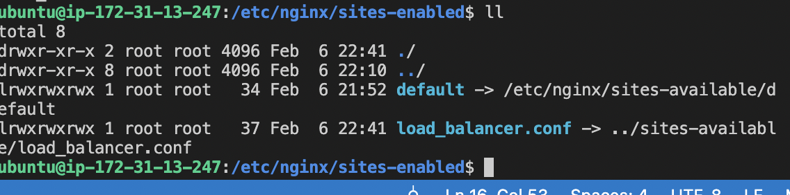
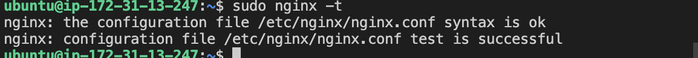

## awesome installation of nginx -project10

`sudo apt update`

`sudo apt install nginx`

`sudo systemctl enable nginx && sudo systemctl start nginx`

`sudo vi /etc/nginx/sites-available/load_balancer.conf`

`sudo rm -f /etc/nginx/sites-enabled/dafault`

`sudo nginx -t`

`cd /ect/nginx/sites-enabled/`

`sudo ln -s ../sites-available/load_balancer.conf .`

`ll`

`sudo systemctl restart nginx`

`sudo apt install certbot -y`

`sudo apt install python3-certbot-nginx -y`

`sudo nginx -t && sudo nginx -s reload`

 
 `sudo certbot --nginx -d toolingysf.co.uk -d www.toolingysf.co.uk`
![certificate produced(./images/cert1.png)
![ctn of cerificate produced(./images/cert2.png)

 `crontab -e`

